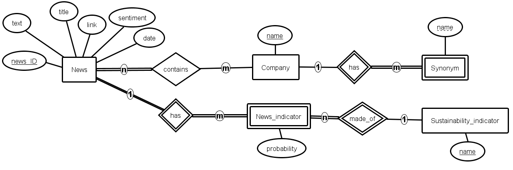

# Company sustainability evaluation using AI-based news analysis

by Ayko Schwedler as part of the bachelor thesis.

## Technologies used

- Technologies: Python
- Python packages: see requirements.txt

## How to start it

1. Install desired PyTorch version (CUDA or normal), to be found at https://pytorch.org/get-started/locally/.
2. Install all modules from requirements.txt with `pip install -r requirements.txt`.
3. If adjustments are desired, there are many options in config.yaml, e.g. how many threads should be used to search for news items. All possible config changes have been described in detail in the file.
4. The API is started with `uvicorn api:app --host 0.0.0.0 --port 8000 --reload` and the news analysis with `python news_text_analysis.py`.

## Functionality

This backend is used to periodically (and therefore independently) search for news articles and then evaluate them using various AI algorithms. In addition, the results as well as the management of the data are made available via an API.

### How the analysis works

1. The stored company name and its stored synonyms are each entered in parallel as search terms in [GNews](https://github.com/ranahaani/GNews). This will yield ~100 news articles per search.
2. Now the analysis is started. Multiprocessing is used for this (depending on whether a CUDA-capable GPU can be used).
   1. First it is checked which companies appear in the given news article.
      - If at least one company is present and the news article has not yet been analysed, continue.
   2. Now perform a classification for the sustainability indicators in the given news article.
   3. Then perform a sentiment analysis for the news article in general.
   4. Save the results in the database.

Several optimisations were carried out, among others: News articles that already exist, are re-examined for relevant companies (if new ones have been added), but not analysed again using resource-intensive AI.

#### Beispiel-Analyse

**Analyzed news article:** Microsoft extends security log retention following State Department ... - Cybersecurity Dive

**Named companies are:**
- Name: Microsoft

**Results of classification:**
<table>
    <tr>
        <th>Label</th>
        <th>Prob</th>
    </tr>
    <tr>
        <td>Not Relevant to ESG</td>
        <td>0.9</td>
    </tr>
    <tr>
        <td>Risk Management and Internal Control</td>
        <td>0.72</td>
    </tr>
    <tr>
        <td>Data Safety</td>
        <td>0.56</td>
    </tr>
    <tr>
        <td>Corporate Governance</td>
        <td>0.35</td>
    </tr>
    <tr>
        <td>Environmental Management</td>
        <td>0.28</td>
    </tr>
    <tr>
        <td>Climate Risks</td>
        <td>0.27</td>
    </tr>
    <tr>
        <td>Supply Chain (Economic / Governance)</td>
        <td>0.26</td>
    </tr>
    <tr>
        <td>Land Acquisition and Resettlement (S)</td>
        <td>0.24</td>
    </tr>
    <tr>
        <td>Biodiversity</td>
        <td>0.19</td>
    </tr>
    <tr>
        <td>Values and Ethics</td>
        <td>0.18</td>
    </tr>
    <tr>
        <td>Wastewater Management</td>
        <td>0.16</td>
    </tr>
    <tr>
        <td>Responsible Investment & Greenwashing</td>
        <td>0.15</td>
    </tr>
    <tr>
        <td>Strategy Implementation</td>
        <td>0.15</td>
    </tr>
    <tr>
        <td>Waste Management</td>
        <td>0.14</td>
    </tr>
    <tr>
        <td>Product Safety and Quality</td>
        <td>0.14</td>
    </tr>
    <tr>
        <td>Surface Water Pollution</td>
        <td>0.12</td>
    </tr>
    <tr>
        <td>Human Rights</td>
        <td>0.12</td>
    </tr>
    <tr>
        <td>Supply Chain (Social)</td>
        <td>0.11</td>
    </tr>
    <tr>
        <td>Forced Labour</td>
        <td>0.11</td>
    </tr>
    <tr>
        <td>Natural Resources</td>
        <td>0.1</td>
    </tr>
    <tr>
        <td>Employee Health and Safety</td>
        <td>0.1</td>
    </tr>
    <tr>
        <td>Planning Limitations</td>
        <td>0.1</td>
    </tr>
    <tr>
        <td>Retrenchment</td>
        <td>0.1</td>
    </tr>
    <tr>
        <td>Emergencies (Social)</td>
        <td>0.1</td>
    </tr>
    <tr>
        <td>Soil and Groundwater Impact</td>
        <td>0.09</td>
    </tr>
    <tr>
        <td>Physical Impacts</td>
        <td>0.09</td>
    </tr>
    <tr>
        <td>Land Acquisition and Resettlement (E)</td>
        <td>0.09</td>
    </tr>
    <tr>
        <td>Discrimination</td>
        <td>0.09</td>
    </tr>
    <tr>
        <td>Hazardous Materials Management</td>
        <td>0.08</td>
    </tr>
    <tr>
        <td>Land Rehabilitation</td>
        <td>0.08</td>
    </tr>
    <tr>
        <td>Emergencies (Environmental)</td>
        <td>0.08</td>
    </tr>
    <tr>
        <td>Energy Efficiency and Renewables</td>
        <td>0.07</td>
    </tr>
    <tr>
        <td>Animal Welfare</td>
        <td>0.07</td>
    </tr>
    <tr>
        <td>Disclosure</td>
        <td>0.07</td>
    </tr>
    <tr>
        <td>Economic Crime</td>
        <td>0.06</td>
    </tr>
    <tr>
        <td>Indigenous People</td>
        <td>0.06</td>
    </tr>
    <tr>
        <td>Landscape Transformation</td>
        <td>0.06</td>
    </tr>
    <tr>
        <td>Legal Proceedings & Law Violations</td>
        <td>0.06</td>
    </tr>
    <tr>
        <td>Water Consumption</td>
        <td>0.06</td>
    </tr>
    <tr>
        <td>Labor Relations Management</td>
        <td>0.05</td>
    </tr>
    <tr>
        <td>Minimum Age and Child Labour</td>
        <td>0.05</td>
    </tr>
    <tr>
        <td>Air Pollution</td>
        <td>0.05</td>
    </tr>
    <tr>
        <td>Greenhouse Gas Emissions</td>
        <td>0.04</td>
    </tr>
    <tr>
        <td>Freedom of Association and Right to Organise</td>
        <td>0.04</td>
    </tr>
    <tr>
        <td>Communities Health and Safety</td>
        <td>0.04</td>
    </tr>
    <tr>
        <td>Supply Chain (Environmental)</td>
        <td>0.03</td>
    </tr>
    <tr>
        <td>Cultural Heritage</td>
        <td>0.03</td>
    </tr>
</table>

**Obtained sentiment:**
6.99/10 (Neutral)

#### How the API works

The REST API is made available with FastAPI. The following functions exist:

*Query parameters marked with * are optional.*

<table>
    <tr>
        <th>API Access Points</th>
        <th>company_name</th>
        <th>date_range</th>
        <th>max_sentiment</th>
        <th>indicator_name</th>
        <th>synonym_name</th>
    </tr>
    <tr>
        <td>/companies</td>
        <td>&#10007;</td>
        <td>&#10007;</td>
        <td>&#10007;</td>
        <td>&#10007;</td>
        <td>&#10007;</td>
    </tr>
    <tr>
        <td>/do_news_exist</td>
        <td>&#10003;</td>
        <td>&#10003;</td>
        <td>&#10003;</td>
        <td>&#10003; &ast;</td>
        <td>&#10007;</td>
    </tr>
    <tr>
        <td>/news_minimum</td>
        <td>&#10003;</td>
        <td>&#10003;</td>
        <td>&#10007</td>
        <td>&#10003; &ast;</td>
        <td>&#10007;</td>
    </tr>
    <tr>
        <td>/news</td>
        <td>&#10003;</td>
        <td>&#10003;</td>
        <td>&#10003;</td>
        <td>&#10003; &ast;</td>
        <td>&#10007;</td>
    </tr>
    <tr>
        <td>/sustainability_indicators</td>
        <td>&#10007;</td>
        <td>&#10007;</td>
        <td>&#10007;</td>
        <td>&#10007;</td>
        <td>&#10007;</td>
    </tr>
    <tr>
        <td>/indicator_stats</td>
        <td>&#10003;</td>
        <td>&#10003;</td>
        <td>&#10003;</td>
        <td>&#10003; &ast;</td>
        <td>&#10007;</td>
    </tr>
    <tr>
        <td>/companies (POST)</td>
        <td>&#10003;</td>
        <td>&#10007;</td>
        <td>&#10007;</td>
        <td>&#10007;</td>
        <td>&#10007;</td>
    </tr>
    <tr>
        <td>/synonyms (POST)</td>
        <td>&#10003;</td>
        <td>&#10007;</td>
        <td>&#10007;</td>
        <td>&#10007;</td>
        <td>&#10003;</td>
    </tr>
    <tr>
        <td>/companies (DELETE)</td>
        <td>&#10003;</td>
        <td>&#10007;</td>
        <td>&#10007;</td>
        <td>&#10007;</td>
        <td>&#10007;</td>
    </tr>
    <tr>
        <td>/synonyms (DELETE)</td>
        <td>&#10003;</td>
        <td>&#10007;</td>
        <td>&#10007;</td>
        <td>&#10007;</td>
        <td>&#10003;</td>
    </tr>
</table>

### Modelling of the database by means of an ER diagram.

- Each news item is assigned at least one company and each sustainability indicator exactly once.
- A news indicator consists of exactly one sustainability indicator.

### Possible improvements to be made

- Instead of only providing results for either one or all indicators, let the API user choose various indicators per request.
- Also let the user choose multiple companies for sake of comparison.
- Allow analysis of news in multiple languages, not just english.
- Should problems arise: Upgrade company identification from basic string matching to a more advanced technology,
for example NER. This would, however, also increase the processing time per news article.
- Use text/sentence similarity algorithms to analyze only one of multiple news, if these have the same topic.
- Let the user select various news agencies to select from, instead of always using Google News.
- Further analysis on the data.

### Notes

- A large part of this code is in German, as the Bachelor thesis itself is written in German.